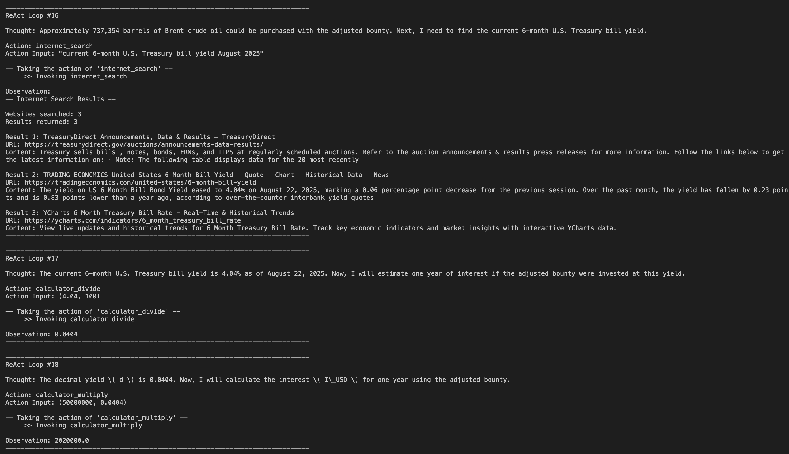

# ReAct-Agent-from-Scratch

A Python implementation of the **ReAct** (Reasoning and Acting) agent from scratch. No libraries, no abstractions, simple and straight to the point.

> This agent ships with six core tools. Intentionally minimal to showcase the **ReAct** loop in pure Python.

----

**ReAct** comes from the paper [ReAct: Synergizing Reasoning and Acting in Language Models](https://arxiv.org/pdf/2210.03629) (2022)

The **ReAct** agent runs in a continuous cycle of `Thought` -> `Action` -> `Observation`.

More concretely:
1. `Thought`: The LLM decides what the next step should be.
2. `Action`: The agent will take an action, such as invoking the tools the LLM decided upon.
3. `Observation`: The LLM observes the output of the invoked tool.
--- 

## ReAct Architecture

---

## Tools

- **calculator_add(a, b)**  
  Add two numbers. Both must be `int` or `float`.

- **calculator_subtract(a, b)**  
  Subtract `b` from `a`. Both must be `int` or `float`.

- **calculator_multiply(a, b)**  
  Multiply two numbers. Both must be `int` or `float`.

- **calculator_divide(a, b)**  
  Divide `a` by `b`. Both must be `int` or `float`. `b` may not be zero.

- **llm_knowledge(prompt)**  
  Free form text generation. **No arithmetic allowed.**

- **internet_search(query)**  
  Searches the web (via Tavily) and returns a **text only**, LLM friendly summary with sources.  
  Input must be a `string`.

---

## Example of ReACT Agent Actions

---

## API Key Requirements
  - `OPENAI_API_KEY` — for the OpenAI client
  - `TAVILY_API_KEY` — for the Tavily search client

Create a `.env` file in the **project root** (the same folder where you run `python src/agent.py`).

Use the `env.example` file as reference for how the `.env` should be structured.

---

## Acknowledgements

This project was kickstarted thanks to James Murdza’s excellent ReAct tutorial on YouTube.  
His prompt design and overall code structure provided the initial foundation upon which this "from-scratch" implementation was built.

- GitHub: [jamesmurdza](https://github.com/jamesmurdza/)  
- YouTube: [AI Agent Camp: Building a ReAct agent from scratch](https://www.youtube.com/watch?v=C0QdSBoJiMs)
